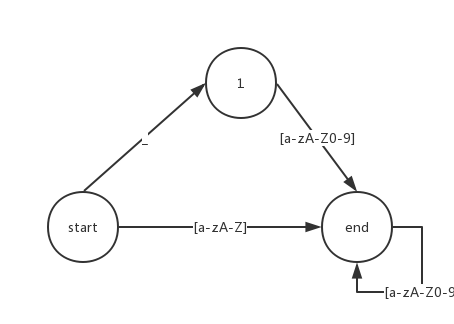
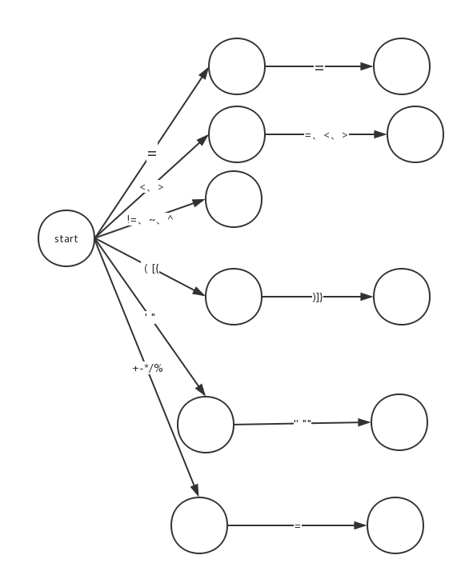
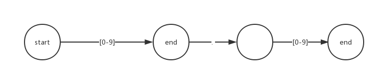
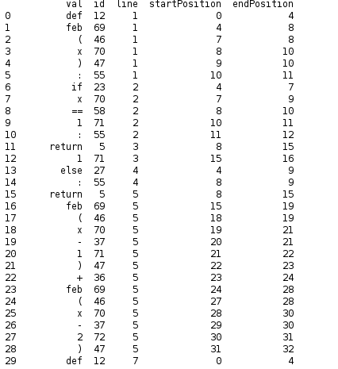
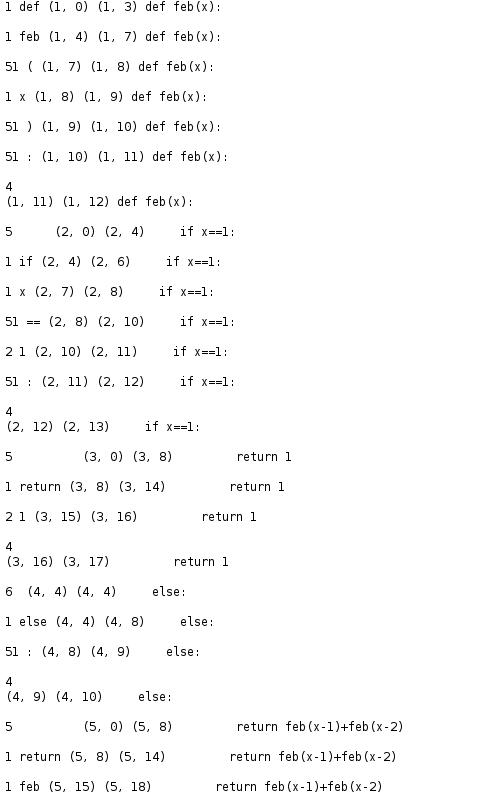

# 词法分析器-Python版
## 大纲
1. 目标
2. 内容概述
3. 假设与依赖
4. 记号定义
5. 思路与方法
6. 有限自动机
7. 测试用例与检验
8. 心得与体会

## 目标
  本次实验的主要目的是对自定义的程序语言的词法分析器程序构造，我从Python语言当中选择了部分具有代表性的子集
  ，实现词法分析器，主要是对编译原理课
  程中学习的从正则表达式转化为
  NFA
  ，再从
  NFA
  转化为
  DFA
  以及后续的代码生成的过程有
  更深刻的认识。同时，也希望对于在编译原理课程中所体现出的计算机科学当中的一些朴素
  而优美的思想有更多的体会。

## 内容概述
首先确定了Python的关键字以及符号并编码，之后幸运的找到了Python自己实现的词法分析工具tokenize中的generate_token方法。并以他为目标，实现了自己的token分析

## 假设与依赖
无恶意代码，因为目标实现了多行注释等识别，但是对于转义字符还没有（无刻意刁难就好）

## 记号定义
|   word   | id | synax | id |
|:--------:|:--:|:-----:|:--:|
|   False  |  1 |   =   | 34 |
|   class  |  2 |   /   | 35 |
|  finally |  3 |   +   | 36 |
|    is    |  4 |   -   | 37 |
|  return  |  5 |   *   | 38 |
|   None   |  6 |   !   | 39 |
| continue |  7 |   #   | 40 |
|    for   |  8 |   %   | 41 |
|  lambda  |  9 |   <   | 42 |
|    try   | 10 |   >   | 43 |
|   True   | 11 |   ^   | 44 |
|    def   | 12 |   ~   | 45 |
|   from   | 13 |   (   | 46 |
| nonlocal | 14 |   )   | 47 |
|   while  | 15 |   [   | 48 |
|    and   | 16 |   ]   | 49 |
|    del   | 17 |   {   | 50 |
|  global  | 18 |   }   | 51 |
|    not   | 19 |   '   | 52 |
|   with   | 20 |   "   | 53 |
|    as    | 21 |   :   | 54 |
|   elif   | 22 |   ;   | 55 |
|    if    | 23 |  '''  | 56 |
|    or    | 24 |   ==  | 57 |
|   yield  | 25 |   !=  | 58 |
|  assert  | 26 |   +=  | 59 |
|   else   | 27 |   -=  | 60 |
|  import  | 28 |   /=  | 61 |
|   pass   | 29 |   *=  | 62 |
|   break  | 30 |   %=  | 63 |
|  except  | 31 |   >>  | 64 |
|    in    | 32 |   <<  | 65 |
|   raise  | 33 |   >=  | 66 |
|          |    |   <=  | 67 |

## 思路与方法
python的好处在于一行基本只有一段代码，因此划分比较简单。之后就按照自动机理论去匹配即可。关于各种自动机的示例在下面一节。匹配分析后，会生成表格，记录token的代号，以及位置等信息。

其中解析多行注释或字符花了一些功夫，因为不知道有几行。。。。
最后是采用上层模块识别的方法。即机器本身也对'''之间的词进行解析，只不过忽视结果直接拼接，直到下一个'''出现

## 有限自动机
我们根据python的语法特性构造了字符、符号以及数字的有限自动机，分别如下图所示:

字符自动机

符号自动机(其中空白圆圈均为终止状态)

数字自动机

## 测试用例与检验

测试用例为：

    def feb(x):
        if x==1:
            return 1
        else:
            return feb(x-1)+feb(x-2)

    def do():
        for i in range(1,200):
            print 'num is '+i
    str='''
    haha
    lalala
    '''
    feb(lambda x:x+1)

我的代码的输出为：

generate_token输出为：

## 心得与体会

本次实践了词法分析的最简单的形式，感觉编译之路真的是博大精深。最大的收获其实是通过阅读generate_token源码获得的，虽然我的实现要丑陋的多。因此，下面贴出代码，以示尊敬

    def generate_tokens(readline):
        """
        The generate_tokens() generator requires one argument, readline, which
        must be a callable object which provides the same interface as the
        readline() method of built-in file objects. Each call to the function
        should return one line of input as a string.  Alternately, readline
        can be a callable function terminating with StopIteration:
            readline = open(myfile).next    # Example of alternate readline

        The generator produces 5-tuples with these members: the token type; the
        token string; a 2-tuple (srow, scol) of ints specifying the row and
        column where the token begins in the source; a 2-tuple (erow, ecol) of
        ints specifying the row and column where the token ends in the source;
        and the line on which the token was found. The line passed is the
        logical line; continuation lines are included.
        """
        lnum = parenlev = continued = 0
        namechars, numchars = string.ascii_letters + '_', '0123456789'
        contstr, needcont = '', 0
        contline = None
        indents = [0]

        while 1:                                   # loop over lines in stream
            try:
                line = readline()
            except StopIteration:
                line = ''
            lnum += 1
            pos, max = 0, len(line)

            if contstr:                            # continued string
                if not line:
                    raise TokenError, ("EOF in multi-line string", strstart)
                endmatch = endprog.match(line)
                if endmatch:
                    pos = end = endmatch.end(0)
                    yield (STRING, contstr + line[:end],
                           strstart, (lnum, end), contline + line)
                    contstr, needcont = '', 0
                    contline = None
                elif needcont and line[-2:] != '\\\n' and line[-3:] != '\\\r\n':
                    yield (ERRORTOKEN, contstr + line,
                               strstart, (lnum, len(line)), contline)
                    contstr = ''
                    contline = None
                    continue
                else:
                    contstr = contstr + line
                    contline = contline + line
                    continue

            elif parenlev == 0 and not continued:  # new statement
                if not line: break
                column = 0
                while pos < max:                   # measure leading whitespace
                    if line[pos] == ' ':
                        column += 1
                    elif line[pos] == '\t':
                        column = (column//tabsize + 1)*tabsize
                    elif line[pos] == '\f':
                        column = 0
                    else:
                        break
                    pos += 1
                if pos == max:
                    break

                if line[pos] in '#\r\n':           # skip comments or blank lines
                    if line[pos] == '#':
                        comment_token = line[pos:].rstrip('\r\n')
                        nl_pos = pos + len(comment_token)
                        yield (COMMENT, comment_token,
                               (lnum, pos), (lnum, pos + len(comment_token)), line)
                        yield (NL, line[nl_pos:],
                               (lnum, nl_pos), (lnum, len(line)), line)
                    else:
                        yield ((NL, COMMENT)[line[pos] == '#'], line[pos:],
                               (lnum, pos), (lnum, len(line)), line)
                    continue

                if column > indents[-1]:           # count indents or dedents
                    indents.append(column)
                    yield (INDENT, line[:pos], (lnum, 0), (lnum, pos), line)
                while column < indents[-1]:
                    if column not in indents:
                        raise IndentationError(
                            "unindent does not match any outer indentation level",
                            ("<tokenize>", lnum, pos, line))
                    indents = indents[:-1]
                    yield (DEDENT, '', (lnum, pos), (lnum, pos), line)

            else:                                  # continued statement
                if not line:
                    raise TokenError, ("EOF in multi-line statement", (lnum, 0))
                continued = 0

            while pos < max:
                pseudomatch = pseudoprog.match(line, pos)
                if pseudomatch:                                # scan for tokens
                    start, end = pseudomatch.span(1)
                    spos, epos, pos = (lnum, start), (lnum, end), end
                    if start == end:
                        continue
                    token, initial = line[start:end], line[start]

                    if initial in numchars or \
                       (initial == '.' and token != '.'):      # ordinary number
                        yield (NUMBER, token, spos, epos, line)
                    elif initial in '\r\n':
                        yield (NL if parenlev > 0 else NEWLINE,
                               token, spos, epos, line)
                    elif initial == '#':
                        assert not token.endswith("\n")
                        yield (COMMENT, token, spos, epos, line)
                    elif token in triple_quoted:
                        endprog = endprogs[token]
                        endmatch = endprog.match(line, pos)
                        if endmatch:                           # all on one line
                            pos = endmatch.end(0)
                            token = line[start:pos]
                            yield (STRING, token, spos, (lnum, pos), line)
                        else:
                            strstart = (lnum, start)           # multiple lines
                            contstr = line[start:]
                            contline = line
                            break
                    elif initial in single_quoted or \
                        token[:2] in single_quoted or \
                        token[:3] in single_quoted:
                        if token[-1] == '\n':                  # continued string
                            strstart = (lnum, start)
                            endprog = (endprogs[initial] or endprogs[token[1]] or
                                       endprogs[token[2]])
                            contstr, needcont = line[start:], 1
                            contline = line
                            break
                        else:                                  # ordinary string
                            yield (STRING, token, spos, epos, line)
                    elif initial in namechars:                 # ordinary name
                        yield (NAME, token, spos, epos, line)
                    elif initial == '\\':                      # continued stmt
                        continued = 1
                    else:
                        if initial in '([{':
                            parenlev += 1
                        elif initial in ')]}':
                            parenlev -= 1
                        yield (OP, token, spos, epos, line)
                else:
                    yield (ERRORTOKEN, line[pos],
                               (lnum, pos), (lnum, pos+1), line)
                    pos += 1

        for indent in indents[1:]:                 # pop remaining indent levels
            yield (DEDENT, '', (lnum, 0), (lnum, 0), '')
        yield (ENDMARKER, '', (lnum, 0), (lnum, 0), '')
