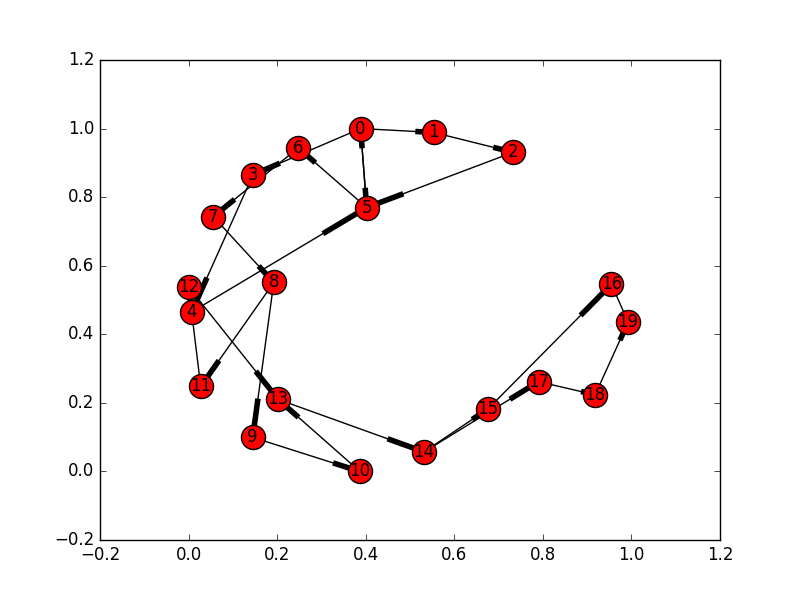
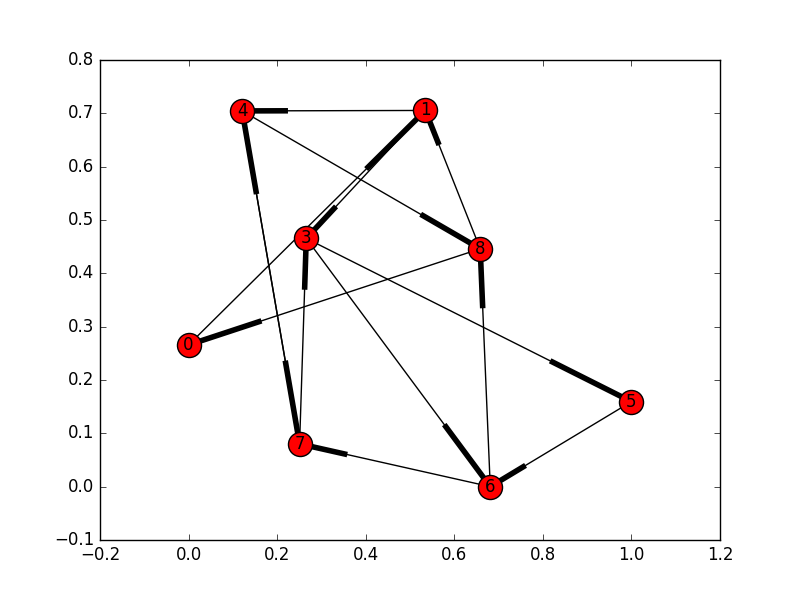
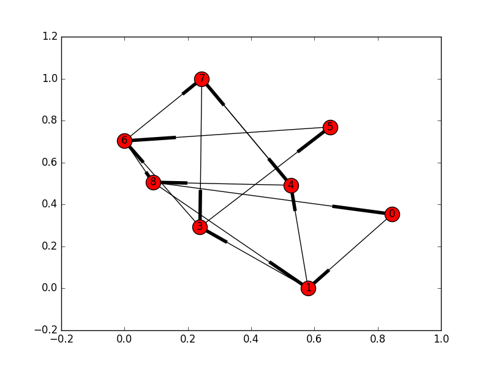

# Lex词法分析器Python版本实验说明

#### Table of contents
- [Lex词法分析器Python版本实验说明](#lexpython)
    - [环境依赖](#)
    - [实验目标](#)
    - [报告叙述思路](#)
    - [Lex词法分析器用法](#lex)
        - [.l文件的组织结构](#l)
        - [Lex使用方法](#lex)
        - [Lex的优秀之处](#lex)
    - [pyLex使用说明书](#pylex)
        - [.cxl文件结构](#cxl)
    - [正则表达式到[dfa](https://zh.wikipedia.org/wiki/%E7%A1%AE%E5%AE%9A%E6%9C%89%E9%99%90%E7%8A%B6%E6%80%81%E8%87%AA%E5%8A%A8%E6%9C%BA)](#dfahttpszhwikipediaorgwikie7a1aee5ae9ae69c89e99990e78ab6e68081e887aae58aa8e69cba)
        - [正则表达式中缀转后缀并补全连接符](#)
        - [后缀的正则到[nfa](https://zh.wikipedia.org/wiki/%E9%9D%9E%E7%A1%AE%E5%AE%9A%E6%9C%89%E9%99%90%E7%8A%B6%E6%80%81%E8%87%AA%E5%8A%A8%E6%9C%BA)](#nfahttpszhwikipediaorgwikie99d9ee7a1aee5ae9ae69c89e99990e78ab6e68081e887aae58aa8e69cba)
        - [nfa到dfa](#nfadfa)
        - [最小化](#)
        - [总结](#)
    - [其他连接工作](#)
        - [Cheetah模板引擎](#cheetah)
        - [图到代码](#)
        - [匹配输入文件](#)
    - [结语](#)

## 环境依赖
* Python 2.7(没有在3.5的情况下测试)
* networkx >= 1.11
* matplotlib >= 1.52
* Cheetah >= 2.4.4

其中networkx是Python的图论包，用于构建nfa与dfa。
 Cheetah是模板引擎，用于生成自动化代码
 然后matplotlib可以图形化图，更加直观
 麻烦助教安装一下了

## 实验目标
为了完成一个近似Lex的pyLex！！！

## 报告叙述思路
主要分为四个部分，第一部分会演示一下Lex的用法并表达一下膜拜之情；之后是自己pyLex的用法；第三部分会详细解释从re到dfa的转换过程；最后是讲解如何读取配置文件，如何生成代码，如何匹配等问题
 整个实验花费了有近一周的时间，从最初的懵逼到对于Lex的敬佩。。。我还是最后再抒情吧

## Lex词法分析器用法
### .l文件的组织结构
参考自[维基百科](https://zh.wikipedia.org/wiki/Lex)和[相关教程](https://www.ibm.com/support/knowledgecenter/zh/ssw_aix_71/com.ibm.aix.cmds3/lex.htm)
 lex 规范文件是.l结尾的文件，lex读取、分析，之后生成一份**可以被编译成可执行程序**的c代码。

>输入文件文件包含三部分：定义、规则和用户子例程。每部分必须用仅含定界符 %%（双百分号）的行和其他部分分开。格式是：

>定义 
%% 
规则 
%% 
用户子例程 

通常来说，我们在定义中引用库，第二部分定义正则与匹配成功后的操作，第三部分作为launcher，即为main函数，因为lex不会帮你写main。例如下面的[.l文件](../gaint/t.l)

    %{           
    #include <stdio.h>

    extern char *yytext;
    extern FILE *yyin;
    int sem_count = 0;

    %}
    %option noyywrap
    %%
    [1-9]+[0-9]*		printf("INTEGER[%s]",yytext);
    [0-9]*\.[0-9]*		{printf("DOUBLE[%s]",yytext);}

    %%
    //上面为规则定义部分，以下为函数定义部分
    int main(int avgs, char *avgr[])
    {
        yyin = fopen(avgr[1], "r");
        if (!yyin)
        {
            return 0;
        }
        yylex();
        printf("sem_count : %d/n\n", sem_count);
        fclose(yyin);

        return 1;
    }
 
第一部分和第三部分会原封不动加入生成的代码中，我们可以看见在第一部分中引入了stdio的库为了后面的printf，定义了yytext，而在第三部分则是一个main，用于启动文件。
 关键的第二部分，我们给出了int和double的正则匹配，并定义了匹配成功的动作，yytext是约定好了的变量名，代表匹配成功的字符，我们相当于输出类型[变量]。

### Lex使用方法

之后运行：

    lex t.l

我用的是Linux-Fedora，Windows下是flex，可以自行搜索一下，之后生成了[lex.yy.c](../gaint/lex.yy.c),用gcc编译、链接后:

    gcc lex.yy.c -o e

得到[可执行程序](../gaint/e),之后我们创建我们的需要分析的[代码](../gaint/tt.c)

    #include <stdio.h>

    int main(){
    double i=1.234;
    int j1=5;
    return 0;
    }

运行刚刚的程序：

    ./e tt.c

得到一下输出：

    #include <stdioDOUBLE[.]h>

    int main(){
    double i=DOUBLE[1.234];
    int jINTEGER[1]=INTEGER[5];
    return 0;
    }
    sem_count : 0/n

可以看到，程序正确的识别了输入字符中所有的可以匹配的元素，高效又使用的工具！

### Lex的优秀之处

* 正则表达式的完整支持
* c语言的高效性
* .l文件结构简单实用

## pyLex使用说明书

### .cxl文件结构

为了简化分析，我将lex中最后一部分删去，当做死的launcher生成，这样文件就剩下两部分，具体如下：

    #raw
    #end raw

    #*
    (0|1|2|3)+
    ##
    print yytext,start,end,linnum
    ##

    (a|b|c)+
    ##
    print yytext,start,end,linnum
    ##

    =
    ##
    print yytext,start,end,linnum
    ##
    *#

第一部分是#raw 和 #end raw的中间部分，可以import相关包，熟悉velocity的话就会发现（Cheetah和velocity是一个思路），这里是我懒惰了，采用了它预定义的关键字。

第二部分是#* *#中间的部分，按照正则、动作的顺序一一对应，由于生成的Python代码对缩进要求很高，因此这里需要注意格式。
 这里我定义了数字、字符和等号来匹配，下面是关于正则的描述：

>仅仅支持正则很小的子集：
>  数字、字母、符号
>  + * |
>  ()
>  \

在动作中，预定义了一下变量：

>yytext 匹配的字符
>  start 开始的位置
>  end 结束的位置
>  linnum 行号

我们写好文件后，运行：

    python gennerate.py [file]

会生成[out.py](out.py)文件，之后运行

    python out.py [file]

会得到输出，例如当[示例文件](t.py)为：

    a=0110
    b=233

得到的输出为:

    a 0 1 0
    = 1 2 0
    0110 2 6 0
    b 0 1 1
    = 1 2 1
    233 2 5 1

以上即为我的pyLex的功能与使用方法

## 正则表达式到[dfa](https://zh.wikipedia.org/wiki/%E7%A1%AE%E5%AE%9A%E6%9C%89%E9%99%90%E7%8A%B6%E6%80%81%E8%87%AA%E5%8A%A8%E6%9C%BA)

总共有两大步、四小步：
* re->nfa
* nfa->dfa
 其中第一步中有转后缀、转nfa，第二步有转dfa，再最小化
 具体代码位于[recore.py](recore.py)中

### 正则表达式中缀转后缀并补全连接符

正则表达式中有一个符号总是被我们忽视，即.(在中间，不是下面)，代表连接，比如ab，全写应该是a.b
我们转后缀的时候需要将其补出。
 补充的条件为：

>当前符号是字母或数字且不是最后一个
>  下一个字符是字母、数字或(、\

之后的中缀转后缀算法和四则运算的类似，这样好处是可以去掉括号。个人感觉这一段反而是最迷的，因为老师课上一笔带过
 网上的资料比较少，运算符优先级很难确定，加上此时的人是乐观的，比如在考虑是否支持反向匹配
 中缀转后缀与网上教程中的生成语法分析树是**等价的**,仔细想想，后缀就是它的后根遍历
 例子：

    (a|b)*a(a|b)(a|b)

补全后是：

    ['(', 'a', '|', 'b', ')', '*', '.', 'a', '.', '(', 'a', '|', 'b', ')', '.', '(', 'a', '|', 'b', ')', '$']

转成后缀：

    ['a', 'b', '|', '*', 'a', '.', 'a', 'b', '|', '.', 'a', 'b', '|', '.']

### 后缀的正则到[nfa](https://zh.wikipedia.org/wiki/%E9%9D%9E%E7%A1%AE%E5%AE%9A%E6%9C%89%E9%99%90%E7%8A%B6%E6%80%81%E8%87%AA%E5%8A%A8%E6%9C%BA)

采用汤普森算法，对于每一个符号有自己的组合方式，这里要膜拜一下[汤普森](https://zh.wikipedia.org/wiki/%E8%82%AF%C2%B7%E6%B1%A4%E6%99%AE%E9%80%8A)
 Unix/c语言、b语言、utf8字符、这个算法以及老爷子在06年以63岁高龄去google工作，共同开发了go语言 orz

算法本身不再说明，因为网上都是，而且很抽象，说一下实现：
 这里就会发现后缀的好处，同时，你需要实现一个有向图（并且支持合并），这里networkx发挥了作用，其用法参考文档
 其实实现图是本次实验另一个难点之一，前面的学姐大牛用c++自己写了一个，我则选择绕过这个难点

实现时，你可以再建一个栈，每次从后缀出一个符号，造图，进图的栈。如果是|,就从图栈中出两个图，合并。过程类似后缀表达式求值，给人很顺畅的感觉。
 例子的图如下

这个图中有0-19个节点，因为有很多以浦西龙边，比较杂乱，就不贴边的数据了

### nfa到dfa

采用书上的最小子集法就好，当你的数据结构好用的时候，还是很快的，其中寻找以浦西龙闭包需要深度优先或广度优先。
 将上面的图转为dfa后，是：

    {
      0: [0, 1, 3, 5, 6],
      1: [0, 1, 3, 4, 5, 6, 7, 8, 9, 11],
      2: [0, 1, 2, 3, 5, 6],
      3: [0, 1, 3, 4, 5, 6, 7, 8, 9, 11, 12, 13, 14, 15, 17],
      4: [0, 1, 2, 3, 5, 6, 10, 13, 14, 15, 17],
      5: [0, 1, 3, 4, 5, 6, 7, 8, 9, 11, 12, 13, 14, 15, 17, 18, 19],
      6: [0, 1, 2, 3, 5, 6, 10, 13, 14, 15, 16, 17, 19],
      7: [0, 1, 3, 4, 5, 6, 7, 8, 9, 11, 18, 19],
      8: [0, 1, 2, 3, 5, 6, 16, 19]
    }
 路径为:

    {
      0: {'a': 1, 'b': 2},
      1: {'a': 3, 'b': 4},
      2: {'a': 1, 'b': 2},
      3: {'a': 5, 'b': 6},
      4: {'a': 7, 'b': 8},
      5: {'a': 5, 'b': 6},
      6: {'a': 7, 'b': 8},
      7: {'a': 3, 'b': 4},
      8: {'a': 1, 'b': 2}
    }

图像为

### 最小化

算法依旧是书上的，直接贴结果：
 0与2合并了

    {
      0: {}, 1: {},
      3: {}, 4: {},
      5: {'e': 1}, 6: {'e': 1},
      7: {'e': 1}, 8: {'e': 1}
    }

其中点中有e的代表结束，nfa的时候我可以保证**只有一个终点且其编号始终最大**,但dfa后不可能，因此需要记录，路径为:

    {
      0: {0: {'c': ['b']}, 1: {'c': ['a']}},
      1: {3: {'c': ['a']}, 4: {'c': ['b']}},
      3: {5: {'c': ['a']}, 6: {'c': ['b']}},
      4: {8: {'c': ['b']}, 7: {'c': ['a']}},
      5: {5: {'c': ['a']}, 6: {'c': ['b']}},
      6: {8: {'c': ['b']}, 7: {'c': ['a']}},
      7: {3: {'c': ['a']}, 4: {'c': ['b']}},
      8: {0: {'c': ['b']}, 1: {'c': ['a']}}
    }

c只是一个符号，另外，dfa的时候可能1到2既有a也有b，因此边的存储需要注意，最后是图

### 总结

个人感觉难点在于网上资料少，另外，总想走捷径，使用哪个算法犹豫不决，导致速度变慢。
 这部分可以单独测试，全部代码在[recore.py](recore.py)中。

## 其他连接工作

虽然上一部分是核心，但是这部分的工作在我看来反而更大，lex并不一定强于正则匹配（虽然它确实也很强），但是他处理输入、输出文件比我强太多了
 这里选择将读取l文件略过，因为将格式定义的严格一点就可以。讲Cheetah使用，以及如何将图转化为switch和如何去匹配

### Cheetah模板引擎

像java中velocity，它支持控制流语句，并根据预设变量来赋值，从模板生成文件，我的模板是[template.tmpl](template.tmpl)。
 语法就不说了，好像这个部分有点少。。

### 图到代码

可以考虑映射成两层switch，图中的每一个node代表一个case，之后的字符又是一层case，比如上面的例子，我们初始就是0,如果读到了a，就返回状态1,下次就是在状态1中选择道路。
 如果某次的字符在状态下没有，则代表这个正则不匹配，应该返回-1代表结束
 如果最后走到了带e的node，之后我返回的是-1206,代表匹配成功，回调用户自定义的动作。

比较坑的是，python中没有switch，而是用的字典和函数指针，下面是一段生成的代码：

      switch0={}
      def case0(token):
          way={}
          way['1']=1
          way['0']=1
          way['3']=1
          way['2']=1
          if way.has_key(token):
              return way[token]
          else:
              return -1
      switch0[0]=case0
      def case1(token):
          way={}
          way['1']=1
          way['0']=1
          way['3']=1
          way['2']=1
          if way.has_key(token):
              return way[token]
          else:
              return -1206
      switch0[1]=case1

switch0代表第一层switch，函数里面的way代表第二层，其中case1中是end node，因此可以返回-1206.

### 匹配输入文件

这点是我最佩服lex的地方，如果仔细看上一个例子，可以发现，如果用户定义多个正则，不仅需要去每个匹配，而且刚刚的小数、整数是冲突的
 我最早的版本是会将小数的整数部分匹配成整数的，这点要纠错就要再发现-1206后不着急，继续匹配。
 但是，也有可能是这样123.b，这时小数不匹配，lex会再将123匹配为整数，而我的则不会，至今尚未实现orz

## 结语

实验完成了一部分，这当中最大的收获是有关lex和汤普森先生的。
 **对于软件工程更加有信心了，我们有GNU、APACHE等等的开源组织，并且他们的产品是顶级的尤其是GNU，他们的产品都是很底层、很麻烦又很困难的，像gcc等等，因此我将lex试用的文件夹命名为gaint，真的是站在巨人肩上的感觉**

                                                                                                          cxworks@NJU
