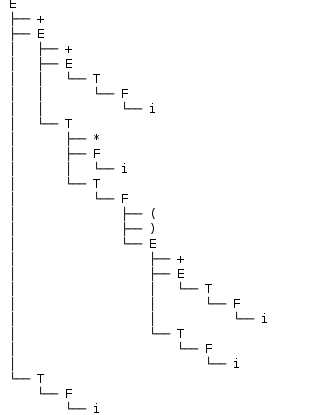

#### Table of contents
- [语法分析实验报告](#语法分析实验报告)
    - [基本目标](#基本目标)
    - [环境依赖](#环境依赖)
    - [文法定义](#文法定义)
    - [由文法生成LR（1）分析表](#由文法生成lr1分析表)
    - [实现细节](#实现细节)
    - [彩蛋](#彩蛋)
    - [测试](#测试)
        - [正常字符](#正常字符)
        - [错误类型1](#错误类型1)
        - [错误类型2](#错误类型2)
    - [总结](#总结)

# 语法分析实验报告

## 基本目标

采用LR（1）或LALR（1）分析并产生预测分析表，按照分析表对输入的字符进行语法分析。若输入合法则打印抽象语法树，反之就显示出错位置

## 环境依赖

* Python 2.7
* pandas >= 0.18
* treelib = 1.3.5

## 文法定义

>* E -> E + F
>* E -> T
>* T -> T * F
>* T -> F
>* F-> ( E )
>* F -> i

## 由文法生成LR（1）分析表

|    | i  | +  | *  | (  | )   | $  | E | T | F  |
|:--:|----|----|----|----|-----|----|---|---|----|
|  0 | S5 |    |    | S4 |     |    | 1 | 2 | 3  |
|  1 |    | S6 |    |    |     | AC |   |   |    |
|  2 |    | R2 | S7 |    | R2  | R2 |   |   |    |
|  3 |    | R4 | R4 |    | R4  | R4 |   |   |    |
|  4 | S5 |    |    | S4 |     |    | 8 | 2 | 3  |
|  5 |    | R6 | R6 |    | R6  | R6 |   |   |    |
| 6  | S5 |    |    | S4 |     |    |   | 9 | 3  |
| 7  | S5 |    |    | S4 |     |    |   |   | 10 |
| 8  |    | S6 |    |    | S11 |    |   |   |    |
| 9  |    | R1 | S7 |    | R1  | R1 |   |   |    |
| 10 |    | R3 | R3 |    | R3  | R3 |   |   |    |
| 11 |    | R5 | R5 |    | R5  | R5 |   |   |    |

采用LR（1）模型构建，过程和作业中的一致，难度不大

## 实现细节

借助pandas的DataFrame，我们可以方便的存储、查询这张预测表。默认是从.csv文件读取的，因此使得程序更加通用

每次从输入带中查看第一个token，然后与预测表对比，如果预测表中没有token，就是unexcepted error

    if test[0] not in table.columns:
        raise CompiledError('%s, unrecognized token at %d' % (test[0],ltest-len(test)))
        ins=table.loc[state[-1],test[0]]
        if len(ins) == 0:
            raise CompiledError('%s complie failed at %d, unexpected token' % (test[0],ltest-len(test)))

之后，查看相应的标识符，分为shift、reduce和AC操作。对于shift操作，就将符号出栈，把目标入栈、状态入栈。

    if ins[0] == 's':
      state.append(int(ins[1:]))
      tree=Tree()
      tree.create_node(test[0],getNext())
      ast.append(tree)
      symbolic.append(test.popleft())

假如是reduce操作，就按照规约规则，将所有规则内的符号、状态出栈，再将目标入栈：

    elif ins[0] == 'r':
      rule=rr[ins]
      print rule
      li=list(rule)
      li.reverse()
      temptree=[]
      for i in li:
        if i != '=' :
          symbolic.pop()
          state.pop()
          temptree.append(ast.pop())
        else:
          break
        symb=rule[:rule.find('=')]
        symbolic.append(symb)
        state.append(int(table.loc[state[-1],symbolic[-1]]))
        tree=Tree()
        ii=getNext()
        tree.create_node(symb,ii)
        for tri in temptree:
          tree.paste(ii,tri)
        ast.append(tree)

如果是AC，则代表分析成功，结束程序

    elif ins == 'AC':
      print 'succeed'
      tree=ast.pop()
      tree.show()
      return

## 彩蛋

延续lab1的想法，找来了一个外部包，可以输出‘漂亮’的分析语法树，就是treelib，麻烦助教安装一下

## 测试

### 正常字符

>* i+(i+i)*i$

### 错误类型1

>* i+(&+i)*i$

### 错误类型2

>* i+(i+i)*$

## 与实验一整合

***此处修改于完成后很久，代码略有改动***

将lab1中的lex文件加入文件夹，并将测试用的文件input.test加入文件夹，目标是用实验一的lex分析词法并生成token，再传给实验二的yacc。

***

### input.test如下所示

    i+(i+i)*i 

用lab1.py处理，输出如下[lab1.out](lab1.out)：

    i (1, 0) (1, 1)
    + (1, 1) (1, 2)
    ( (1, 2) (1, 3)
    i (1, 3) (1, 4)
    + (1, 4) (1, 5)
    i (1, 5) (1, 6)
    ) (1, 6) (1, 7)
    * (1, 7) (1, 8)
    i (1, 8) (1, 9)

之后将其作为输入启动lr.py

    python lr.py lab1.out

可以得到语法分析的结果：

## 总结

通过这次实验，对于Yacc有了一定了解，同时，加深了语法分析的熟练度。最主要的是，yet another compiler compiler
现在读起来很有嘲讽的意思。我现在有写pYacc的想法，只是11月期末加大作业恐难以实现，不过谁知道呢，希望助教可以阅读我的第二份报告把

***修改于11-14***

完成了一部分的yacc，请助教移步到下一个文件夹吧

