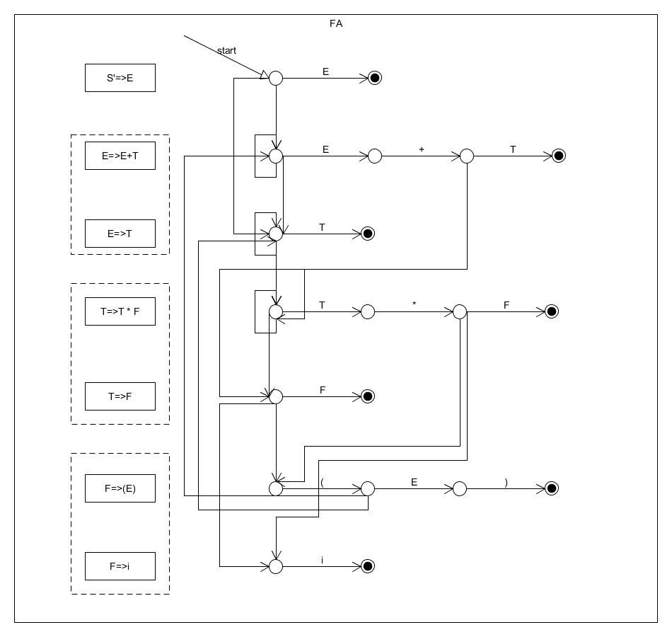

# pyYacc(部分)实验报告

## 目标

本次实验采用了另辟蹊径的方法与老师的方法相结合的方式，写出来了由文法到预测分析表转换的部分。
 但困于时间紧迫，未能完成生成代码的操作，希望我可以良心发现，为这个项目画上完整的句号。

## 环境依赖

* python 2.7
* pandas >= 0.19.0
* networkx >= 1.11

## 叙述思路

* 第一部分是PPT自动生成的使用方法以及测试
* 第二部分是过程的详细叙述，重点在于方法于老师之间的差异与相同之处

## 使用说明

### 用例文法

这个文法将贯穿整个实验报告作为例子，在[rules.y](rules.y)中:

    s -> s + t
    s -> t
    t -> t * f
    t -> f
    f -> ( s )
    f -> i

### .y文件要求

由于实现的是yacc的部分，因此只需要写出目标文法即可。我是采用空格进行分词的，因此所有符号间都要有空格
具体请见实例文件

### 输出

输出设计成了简明易懂的控制台输出与.csv文件一同进行保存，例如测试文法的最终结果为:

.csv文件内容如下:

    ,(,),*,+,f,i,s,t,$
    0,s4,,,,3.0,s5,1.0,2.0,
    1,,,,s6,,,,,AC
    2,,r2,s7,r2,,,,,r2
    3,,r4,r4,r4,,,,,r4
    4,s4,,,,3.0,s5,8.0,2.0,
    5,,r6,r6,r6,,,,,r6
    6,s4,,,,3.0,s5,,9.0,
    7,s4,,,,10.0,s5,,,
    8,,s11,,s6,,,,,
    9,,r1,s7,r1,,,,,r1
    10,,r3,r3,r3,,,,,r3
    11,,r5,r5,r5,,,,,r5

### 使用

完成.y文件后，输入以下指令:

    python gcore.py *.y

会将结果打印在控制台并输出table.csv文件

## 过程详解

### 从文法到dfa

按照课堂的步骤，拿到文法后可以构造出类似下面的状态图：

之后按照熟悉的步骤，我们可以将nfa转换成dfa，这一步是区别于老师的作业步骤的。作业中是直接构造dfa，并一直求first、follow。而老师当时上课时有提到过一句这个，这里想尝试一下。
 具体的转换代码在gcore.py中，这里不再详述，步骤是不变的，**找闭包、合并、最小化**，最后的结果如下：

    {0: {}, 1: {'e': 1}, 2: {'e': 1}, 3: {'e': 1}, 4: {}, 5: {'e': 1}, 6: {}, 7: {}, 8: {}, 9: {'e': 1}, 10: {'e': 1}, 11: {'e': 1}}
    {0: {1: {'c': ['s']}, 2: {'c': ['t']}, 3: {'c': ['f']}, 4: {'c': ['(']}, 5: {'c': ['i']}}, 1: {6: {'c': ['+']}}, 2: {7: {'c': ['*']}}, 3: {}, 4: {8: {'c': ['s']}, 2: {'c': ['t']}, 3: {'c': ['f']}, 4: {'c': ['(']}, 5: {'c': ['i']}}, 5: {}, 6: {9: {'c': ['t']}, 3: {'c': ['f']}, 4: {'c': ['(']}, 5: {'c': ['i']}}, 7: {10: {'c': ['f']}, 4: {'c': ['(']}, 5: {'c': ['i']}}, 8: {11: {'c': [')']}, 6: {'c': ['+']}}, 9: {7: {'c': ['*']}}, 10: {}, 11: {}}

直接越过结果，他们已经是ppt中除了规约的部分了，包含s、和数字，令人振奋！

### 规约

图的解法应该有其他规约的方式，不过时间稍显紧迫，我没有探究，只好老老实实的按照老师的步骤去求follow，因此才有了first_follow.py.算法叙述出来不难，一共就4条，但是具体实现起来总是千变万化。实现follow的部分如下：

    while flag:
           flag=False
           for k,lis in rules_dict.items():
               if k == rules_keys[0] and '$' not in follow_dict[k]:
                   follow_dict[k].append('$')
               for tmp_rule_str in lis:

                   for i in xrange(key_count):
                       if rules_keys[i] in tmp_rule_str:
                           tmp_rule_list = tmp_rule_str
                           current_non_term_index = tmp_rule_list.index(rules_keys[i])

                           if current_non_term_index == (len(tmp_rule_list) - 1):
                               ext=[x for x in follow_dict[k] if x not in follow_dict[rules_keys[i]]]
                               if len(ext)>0:
                                   flag=True
                                   follow_dict[rules_keys[i]].extend(ext)
                           else:
                               ttt=tmp_rule_list[current_non_term_index+1]
                               if ttt not  in rules_keys :
                                   if  ttt in follow_dict[rules_keys[i]]:
                                       continue
                                   flag=True
                                   follow_dict[rules_keys[i]].append(ttt)
                               else:
                                   ext=[x for x in firsts_dict[ttt] if x not in follow_dict[rules_keys[i]]]
                                   if len(ext)>0:
                                       flag=True
                                       follow_dict[rules_keys[i]].extend(ext)

本质上是一个累加的过程一层一层的传递，知道到达稳定状态。具体规则如下：

>* First put $ (the end of input marker) in Follow(S) (S is the start symbol) 
>* If there is a production A → aBb, (where a can be a whole string) then everything in FIRST(b) except for ε is placed in FOLLOW(B). 
>* If there is a production A → aB, then everything in FOLLOW(A) is in FOLLOW(B) 
>* If there is a production A → aBb, where FIRST(b) contains ε, then everything in FOLLOW(A) is in FOLLOW(B) 

而first要简单一些：

    while flag:
            flag=False
            for rule in reversed(rules):
                if rule[2] in firsts and len([x for x in firsts_dict[rule[2]] if x not in firsts_dict[rule[0]]])>0:
                    firsts_dict[rule[0]].extend(firsts_dict[rule[2]])
                    flag=True

规则如下：

>    If X is a terminal then First(X) is just X! 
    If there is a Production X → ε then add ε to first(X) 
    If there is a Production X → Y1Y2..Yk then add first(Y1Y2..Yk) to first(X) 
    First(Y1Y2..Yk) is either 
        First(Y1) (if First(Y1) doesn't contain ε) 
        OR (if First(Y1) does contain ε) then First (Y1Y2..Yk) is everything in First(Y1) <except for ε > as well as everything in First(Y2..Yk) 
        If First(Y1) First(Y2)..First(Yk) all contain ε then add ε to First(Y1Y2..Yk) as well. 

## 总结

这次编译原理大作业难在时间，临近期末使得你没有时间去完成这样一件很有趣的工作。Yacc本身也给人感觉更有趣一些，yet another compiler complier的名字嵌套着递归。

最后，希望您批改愉快，早点休息
